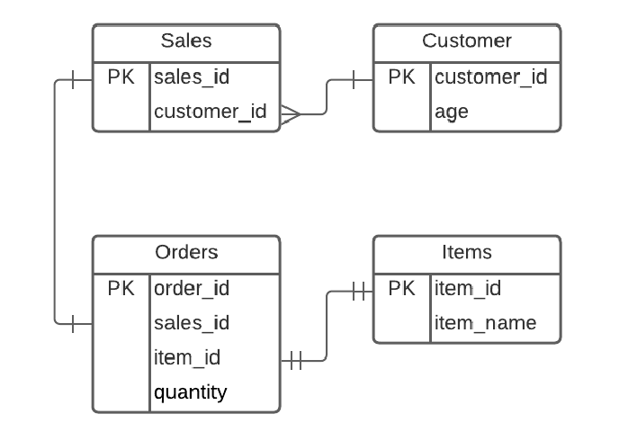

# Sales Data Analysis README

## Overview
This Python script is designed to analyze sales data for a fictional company named "Company XYZ." The company held a promotional sale for their signature items named 'x,' 'y,' and 'z' and is interested in creating a marketing strategy to target age groups of people based on the total quantities purchased. The script connects to a SQLite3 database, extracts relevant data, and provides two solutions to analyze the data: one using purely SQL and the other using Pandas.

## Table Structure and Relationships
The database used in this analysis consists of four tables: Sales, Orders, Customer, and Items. Here is an overview of their columns, primary keys (PK), and foreign key relationships:

1. **Sales Table**:
   - Columns: sales_id (PK), customer_id
   - Relationship: Many-to-one relationship between the sales_id and customer_id, where sales_id references customer_id from the Customer table.

2. **Customer Table**:
   - Columns: customer_id (PK), age

3. **Orders Table**:
   - Columns: order_id (PK), sales_id (FK), item_id, quantity
   - Relationships: One-to-one relationship between sales_id in the Orders table and sales_id in the Sales table. The item_id references the item_id in the Items table.

4. **Items Table**:
   - Columns: item_id (PK), item_name

## Script Functionality
The script provides the following functionality:

1. **Connecting to the Database**:
   - The script connects to the SQLite3 database provided in the 'eastvantagedb.db' file and prints a success message upon successful connection.

2. **Creating Tables**:
   - The script creates tables in the database, dropping existing tables if they exist. The table structure and relationships are defined in the 'CREATE_DDL_STATEMENTS.sql' file.

3. **Inserting Mock Data**:
   - Mock data is inserted into the Customer, Items, Sales, and Orders tables in the database. This data includes customer ages, item names, sales transactions, and order quantities.

4. **Extracting Total Quantities**:
   - The script extracts the total quantities of each item purchased by customers aged between 18 and 35. The results are obtained using two methods: a purely SQL solution and a Pandas-based solution.
   - In the SQL solution, a query retrieves the data with specific conditions and calculates the total quantities for each item.
   - In the Pandas solution, the script reads data from multiple tables, performs joins, filters the data based on age, groups the data, and sums the quantity to achieve the same result.

5. **Writing Results to a CSV File**:
   - The results from the analysis are written to an output file in CSV format. The delimiter used in the output file is the semicolon (';'). Each row in the output file corresponds to a customer's age, item name, and total quantity purchased.

## Running the Script
1. Ensure that you have the required Python libraries installed. You can install them using `pip install sqlite3 pandas`.
2. Place the script in the same directory as the 'eastvantagedb.db' and 'CREATE_DDL_STATEMENTS.sql' files.
3. Run the script using a Python interpreter. The script will perform the analysis and generate an output file named 'output.csv.'
4. You can view the results in the 'output.csv' file, which contains the total quantities purchased by customers aged 18 to 35.

## Test Case
A test case scenario is provided to verify the correctness of the analysis. For example, if Customer 1 bought Item X multiple times, the script will correctly calculate the total quantity of Item X for that customer.

## Exception Handling
The script includes error handling to catch and raise exceptions if any errors occur during the execution. If an error occurs, the script will print an error message and exit gracefully.

Please note that the script's functionality is based on the provided database and data, and it may need modification if the database or data structure changes.

For any questions or issues, please contact [Your Name] at [Your Email Address].